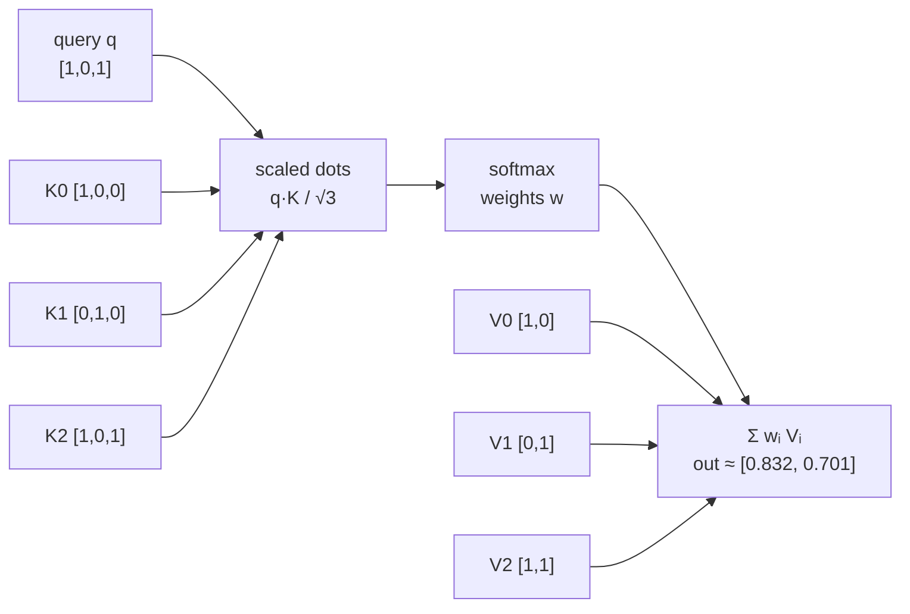

# Attention diagram — one educational head

One-screen map of the head in `attention_warrior/core.py` (`AttentionHead.attend`).
Same toy vectors as [`examples/toy-attention-walkthrough.md`](../examples/toy-attention-walkthrough.md) and the last line of `python3 main.py`.

## Pipeline (ASCII)

```text
                    ┌──────────── query q ────────────┐
                    │           [1, 0, 1]             │
                    └───────────────┬─────────────────┘
                                    │
                                    │  score_i = (q · K_i) / √dim
                                    │  dim = 3,  √3 ≈ 1.732
                                    ▼
         ┌──────────────┬───────────────┬──────────────┐
         │   key K0     │    key K1     │    key K2    │
         │  [1, 0, 0]   │   [0, 1, 0]   │  [1, 0, 1]   │
         │ score ≈ 0.58 │  score = 0    │ score ≈ 1.15 │
         └──────┬───────┴───────┬───────┴──────┬───────┘
                │               │              │
                └───────────────┼──────────────┘
                                ▼
                         softmax(scores)
                    w ≈ [0.299, 0.168, 0.533]
                                │
                ┌───────────────┼───────────────┐
                ▼               ▼               ▼
           value V0        value V1        value V2
            [1, 0]          [0, 1]          [1, 1]
                │               │               │
                └─────── w·V weighted sum ──────┘
                                ▼
                     output ≈ [0.832, 0.701]
```

Read left-to-right as: **match** (dots) → **normalize** (softmax) → **blend** (weighted values).
That is the whole educational head — no multi-layer stack, no tokenizer, no training loop.

## Same flow (mermaid)



## Why key 2 wins

`q` and `K2` both light up dims 0 and 2, so their dot is largest (`2`). Softmax turns that into ~53% of the blend; the orthogonal key (`K1`) gets the smallest share. Change one key in `main.py` and the weights move — that is the lesson.

## Where the code lives

```text
scores  = [dot(query, k) / sqrt(dim) for k in keys]
weights = softmax(scores)
out     = Σ_i  weights[i] * values[i]
return out, weights
```

See `AttentionHead.attend` in `attention_warrior/core.py`. Numbers above match the deterministic toy printed by `main.py`.
